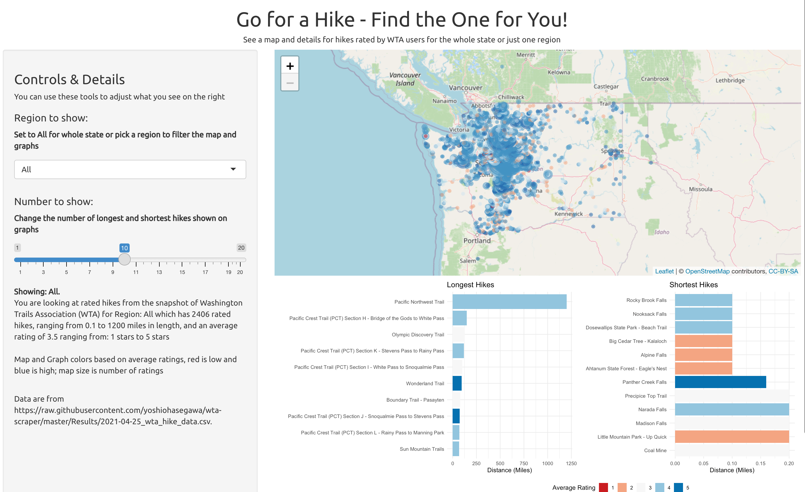

Go For A Hike App
========================================================
author: Developing Data Products Project Presentation
date: 2021-12-31
font-family: 'Helvetica'
autosize: true

Purpose
========================================================
type: exclaim

The Go For a Hike App is designed to help people find a suitable hike for them. 
Users can filter to see:

- Hikes by Region (Location)
- Long and Short hikes
- Average User Ratings

Landing Page
========================================================
type: exclaim

Users see all rated hikes on the landing page. 

Interactivity
========================================================
type: exclaim

There are two methods users can interact with the application, using the controls on the right.

- Show a single region: *users can select one of the regions to filter the data*
- Select the number of hikes to see details: *users can select between one and twenty hikes (ties are shown) for the longest and shortest.*

Users get information about average ratings and distance

Data
========================================================
type: exclaim

  
  <table class="gt_table">
  
  <thead class="gt_col_headings">
    <tr>
      <th class="gt_col_heading gt_columns_bottom_border gt_left" rowspan="1" colspan="1"><strong>Variable</strong></th>
      <th class="gt_col_heading gt_columns_bottom_border gt_center" rowspan="1" colspan="1"><strong>Central Cascades</strong>, N = 2301</th>
      <th class="gt_col_heading gt_columns_bottom_border gt_center" rowspan="1" colspan="1"><strong>Central Washington</strong>, N = 871</th>
      <th class="gt_col_heading gt_columns_bottom_border gt_center" rowspan="1" colspan="1"><strong>Eastern Washington</strong>, N = 1161</th>
      <th class="gt_col_heading gt_columns_bottom_border gt_center" rowspan="1" colspan="1"><strong>Issaquah Alps</strong>, N = 1091</th>
      <th class="gt_col_heading gt_columns_bottom_border gt_center" rowspan="1" colspan="1"><strong>Mount Rainier Area</strong>, N = 1881</th>
      <th class="gt_col_heading gt_columns_bottom_border gt_center" rowspan="1" colspan="1"><strong>North Cascades</strong>, N = 2991</th>
      <th class="gt_col_heading gt_columns_bottom_border gt_center" rowspan="1" colspan="1"><strong>Olympic Peninsula</strong>, N = 2481</th>
      <th class="gt_col_heading gt_columns_bottom_border gt_center" rowspan="1" colspan="1"><strong>Puget Sound and Islands</strong>, N = 2801</th>
      <th class="gt_col_heading gt_columns_bottom_border gt_center" rowspan="1" colspan="1"><strong>Snoqualmie Region</strong>, N = 2151</th>
      <th class="gt_col_heading gt_columns_bottom_border gt_center" rowspan="1" colspan="1"><strong>South Cascades</strong>, N = 1891</th>
      <th class="gt_col_heading gt_columns_bottom_border gt_center" rowspan="1" colspan="1"><strong>Southwest Washington</strong>, N = 1171</th>
    </tr>
  </thead>
  <tbody class="gt_table_body">
    <tr><td class="gt_row gt_left" style="font-weight: bold;">DISTANCE</td>
<td class="gt_row gt_center">8.0</td>
<td class="gt_row gt_center">5.0</td>
<td class="gt_row gt_center">5.8</td>
<td class="gt_row gt_center">2.6</td>
<td class="gt_row gt_center">6.0</td>
<td class="gt_row gt_center">8.0</td>
<td class="gt_row gt_center">6.2</td>
<td class="gt_row gt_center">3.0</td>
<td class="gt_row gt_center">8.0</td>
<td class="gt_row gt_center">7.0</td>
<td class="gt_row gt_center">4.4</td></tr>
    <tr><td class="gt_row gt_left" style="font-weight: bold;">RATING</td>
<td class="gt_row gt_center">3.50</td>
<td class="gt_row gt_center">3.50</td>
<td class="gt_row gt_center">3.60</td>
<td class="gt_row gt_center">3.05</td>
<td class="gt_row gt_center">3.73</td>
<td class="gt_row gt_center">3.60</td>
<td class="gt_row gt_center">3.67</td>
<td class="gt_row gt_center">3.50</td>
<td class="gt_row gt_center">3.67</td>
<td class="gt_row gt_center">3.29</td>
<td class="gt_row gt_center">3.60</td></tr>
    <tr><td class="gt_row gt_left" style="font-weight: bold;">LATITUDE</td>
<td class="gt_row gt_center">47.79</td>
<td class="gt_row gt_center">46.93</td>
<td class="gt_row gt_center">47.90</td>
<td class="gt_row gt_center">47.53</td>
<td class="gt_row gt_center">46.89</td>
<td class="gt_row gt_center">48.53</td>
<td class="gt_row gt_center">47.82</td>
<td class="gt_row gt_center">47.79</td>
<td class="gt_row gt_center">47.43</td>
<td class="gt_row gt_center">46.30</td>
<td class="gt_row gt_center">45.77</td></tr>
    <tr><td class="gt_row gt_left" style="font-weight: bold;">LONGITUDE</td>
<td class="gt_row gt_center">-120.87</td>
<td class="gt_row gt_center">-120.01</td>
<td class="gt_row gt_center">-117.53</td>
<td class="gt_row gt_center">-122.03</td>
<td class="gt_row gt_center">-121.70</td>
<td class="gt_row gt_center">-121.29</td>
<td class="gt_row gt_center">-123.32</td>
<td class="gt_row gt_center">-122.36</td>
<td class="gt_row gt_center">-121.41</td>
<td class="gt_row gt_center">-121.76</td>
<td class="gt_row gt_center">-122.12</td></tr>
    <tr><td class="gt_row gt_left" style="font-weight: bold;">REPORT_COUNT</td>
<td class="gt_row gt_center">49</td>
<td class="gt_row gt_center">20</td>
<td class="gt_row gt_center">10</td>
<td class="gt_row gt_center">61</td>
<td class="gt_row gt_center">56</td>
<td class="gt_row gt_center">41</td>
<td class="gt_row gt_center">40</td>
<td class="gt_row gt_center">21</td>
<td class="gt_row gt_center">106</td>
<td class="gt_row gt_center">18</td>
<td class="gt_row gt_center">16</td></tr>
  </tbody>
  <tfoot class="gt_sourcenotes">
    <tr>
      <td class="gt_sourcenote" colspan="12"><em>The data shown in the app and this presentation are taken directly fromhttps://raw.githubusercontent.com/yoshiohasegawa/wta-scraper/master/Results/2021-04-25_wta_hike_data.csvand represent a snapshot in time of WTA data.</em></td>
    </tr>
  </tfoot>
  <tfoot>
    <tr class="gt_footnotes">
      <td colspan="12">
        

          
            <em>1</em>
          
           
          Median
           
        

      </td>
    </tr>
  </tfoot>
</table>

